name: footer
layout: true

.footer[&copy;&nbsp;2017 HC System, Inc]

---
name: ChartTypes
class: middle, center

## 图表分类

---
name: Scatter1
class: center

### 散点图

???
散点图也叫 X-Y 图，它将所有的数据以点的形式展现在直角坐标系上，以显示变量之间的相互影响程度，点的位置由变量的数值决定。

---
class: center

### 散点图

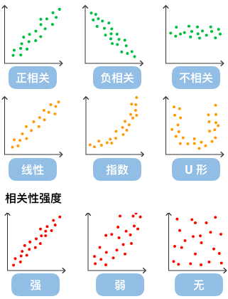

???
通过观察散点图上数据点的分布情况，我们可以推断出变量间的相关性。如果变量之间不存在相互关系，那么在散点图上就会表现为随机分布的离散的点，如果存在某种相关性，那么大部分的数据点就会相对密集并以某种趋势呈现。数据的相关关系主要分为：正相关（两个变量值同时增长）、负相关（一个变量值增加另一个变量值下降）、不相关、线性相关、指数相关等，表现在散点图上的大致分布如下图所示。那些离点集群较远的点我们称为离群点或者异常点。

---
name: Scatter3
class: center

### 散点图

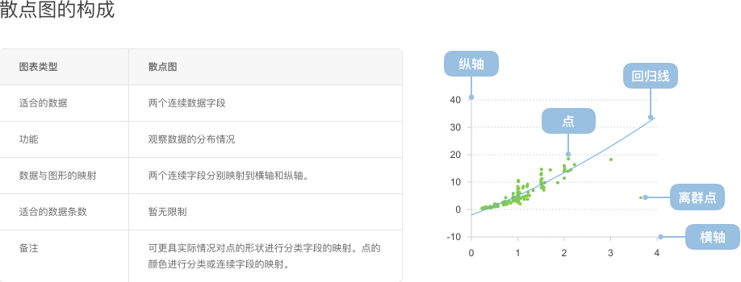

???
散点图经常与回归线（就是最准确地贯穿所有点的线）结合使用，归纳分析现有数据以进行预测分析。

对于那些变量之间存在密切关系，但是这些关系又不像数学公式和物理公式那样能够精确表达的，散点图是一种很好的图形工具。但是在分析过程中需要注意，这两个变量之间的相关性并不等同于确定的因果关系，也可能需要考虑其他的影响因素。

散点图的扩展有气泡图和散点矩阵图，后面我们会提到气泡图，而对于散点矩阵图，他是散点图的高纬扩展，用于专门的统计分析，我们这里不做过多的讲解，有兴趣的可以自行下去了解。

---
name: Bubble1

### 气泡图

???
气泡图是一种多变量图表，是散点图的变体，也可以认为是散点图和百分比区域图的组合。

气泡图最基本的用法是使用三个值来确定每个数据序列，和散点图一样，气泡图将两个维度的数据值分别映射为笛卡尔坐标系上的坐标点，其中 X 和 Y 轴分别代表不同的两个维度的数据，但是不同于散点图的是，气泡图的每个气泡都有分类信息（他们显示在点旁边或者作为图例）。每一个气泡的面积代表第三个数值数据。另外还可以使用不同的颜色来区分分类数据或者其他的数值数据，或者使用亮度或者透明度。表示时间维度的数据时，可以将时间维度作为直角坐标系中的一个维度，或者结合动画来表现数据随着时间的变化情况。

气泡图通常用于比较和展示不同类别圆点（这里我们称为气泡）之间的关系，通过气泡的位置以及面积大小。从整体上看，气泡图可用于分析数据之间的相关性。

需要注意的是，气泡图的数据大小容量有限，气泡太多会使图表难以阅读。但是可以通过增加一些交互行为弥补：隐藏一些信息，当鼠标点击或者悬浮时显示，或者添加一个选项用于重组或者过滤分组类别。

另外，气泡的大小是映射到面积而不是半径或者直径绘制的。因为如果是基于半径或者直径的话，圆的大小不仅会呈指数级变化，而且还会导致视觉误差。

---
name: 
class: center

### 气泡图
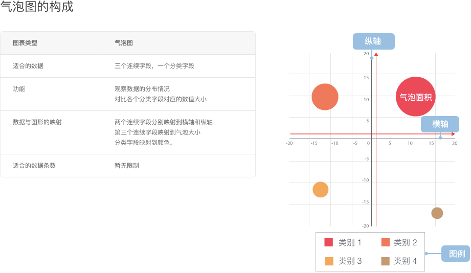

???
气泡图是散点图的扩展，那么它们之间有什么区别呢？

散点图侧重于数据的分布规律，数据分析的侧重点是位置，而气泡图将数值映射到气泡的大小上，数据分析的侧重点先是大小，再是位置。

散点图可以绘制成千上万个数据，而气泡图为乐防止相互遮挡，在绘制时要控制数据的规模。

气泡图一般用于三个应用场景，一个是数据分类对比，但是如果数据对比不是特别明显的时候，用气泡图还不如用柱状图。另一个是多变量映射，用于分析数据的相关性，气泡图是在散点图基础上增加维度展示出的效果，他还可以再扩展，例如气泡的颜色和形状。第三就是和地图结合，显示不同地图的不同特征。

---
name: Line1
class: center

### 折线图

???
折线图用于显示数据在一个连续的时间间隔或者时间跨度上的变化，它的特点是反映事物随时间或有序类别而变化的趋势。

在折线图中，数据是递增还是递减、增减的速率、增减的规律（周期性、螺旋性等）、峰值等特征都可以清晰地反映出来。所以，折线图常用来分析数据随时间的变化趋势，也可用来分析多组数据随时间变化的相互作用和相互影响。例如可用来分析某类商品或是某几类相关的商品随时间变化的销售情况，从而进一步预测未来的销售情况。在折线图中，一般水平轴（X轴）用来表示时间的推移，并且间隔相同；而垂直轴（Y轴）代表不同时刻的数据的大小。

---
class: center

### 折线图

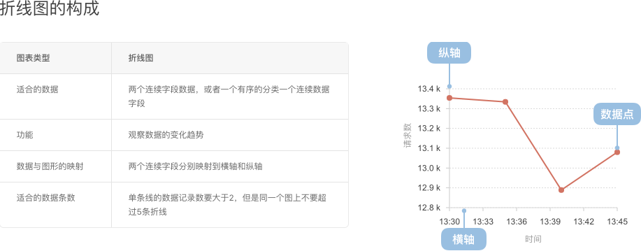

---
name: Bar1
class: center

???
折线图的应用场景很适合有序的因变量，例如X轴是时间序列，通过连接将整体趋势很好的表达出来。当X轴不是连续数字标尺时，就不太适合折线图，使用柱状图或许会更适合。

### 柱状图

???
典型的柱状图（又名条形图），使用垂直或水平的柱子显示类别之间的数值比较。其中一个轴表示需要对比的分类维度，另一个轴代表相应的数值。

柱状图有别于直方图，柱状图无法显示数据在一个区间内的连续变化趋势。柱状图描述的是分类数据，回答的是每一个分类中“有多少？”这个问题。而直方图是一个统计图，描绘的是出现特定数据量的频次。

---
name:
class: center

### 柱状图

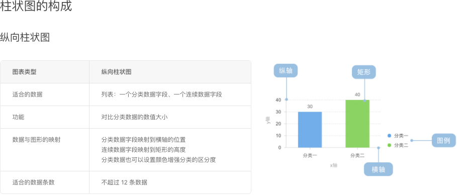

???
柱状图非常适合应用到分类数据对比，例如不同季度的销售额度。但他的分类是有限制的，不能无限多，例如展示一年365天每天的运动时间。如果分类不多，但用纵向图又不够用的时候，横向柱状图（条形图）也是可以的，此时的Y轴只能显示无序的维度，并且要对度量进行排序。这里说到的无序，对于柱状图来说非常关键，如果是有序的，使用折线图或者面积图都会比柱状图表示的结果要好的多。

---
name: 
class: center

### 柱状图

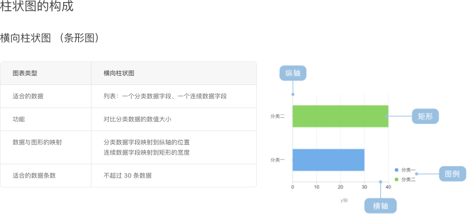

???
柱状图非常适合应用到分类数据对比，例如不同季度的销售额度。但他的分类是有限制的，不能无限多，例如展示一年365天每天的运动时间。如果分类不多，但用纵向图又不够用的时候，横向柱状图（条形图）也是可以的，此时的Y轴只能显示无序的维度，并且要对度量进行排序。这里说到的无序，对于柱状图来说非常关键，如果是有序的，使用折线图或者面积图都会比柱状图表示的结果要好的多。

---
name: Histogram1
class: center

### 直方图

???
直方图，形状类似柱状图却有着与柱状图完全不同的含义。直方图牵涉统计学的概念，首先要对数据进行分组，然后统计每个分组内数据元的数量。 在平面直角坐标系中，横轴标出每个组的端点，纵轴表示频数，每个矩形的高代表对应的频数，称这样的统计图为频数分布直方图。频数分布直方图需要经过频数乘以组距的计算过程才能得出每个分组的数量，同一个直方图的组距是一个固定不变的值，所以如果直接用纵轴表示数量，每个矩形的高代表对应的数据元数量，既能保持分布状态不变，又能直观的看出每个分组的数量。本文的例子全部使用纵轴表示数量的非标准直方图绘制。

相关概念：
组数：在统计数据时，我们把数据按照不同的范围分成几个组，分成的组的个数称为组数
组距：每一组两个端点的差
频数：分组内的数据元的数量除以组距

直方图能够显示各个组数或数量的分布情况，易于显示各个组之间频数或数量的差别。通过直方图还可以观察和估计哪些数据比较集中，异常或者孤立的数据分布在何处。

---
class: center

### 直方图

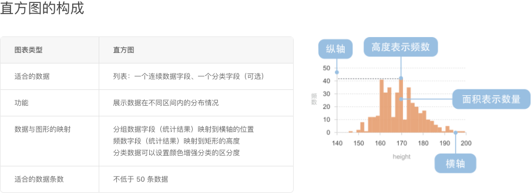

???
因为直方图是统计图，所以抽取的样本过小，将会产生很大的误差，可信度低，也就失去了统计的意义。并且，低样本的统计结果也不利于可视化的绘制。因此，采样数量不应该低于50个。

---
name: Area1
class: center

### 面积图

???
面积图又叫区域图。 它是在折线图的基础之上形成的, 它将折线图中折线与自变量坐标轴之间的区域使用颜色或者纹理填充，这样一个填充区域我们叫做面积，颜色的填充可以更好的突出趋势信息，需要注意的是颜色要带有一定的透明度，透明度可以很好的帮助使用者观察不同序列之间的重叠关系，没有透明度的面积会导致不同序列之间相互遮盖减少可以被观察到的信息。

和折线图一样，面积图也用于强调数量随时间而变化的程度，也可用于引起人们对总值趋势的注意。他们最常用于表现趋势和关系,而不是传达特定的值。

面积图有两种常用的类型：

一般面积图：所有的数据都从相同的零轴开始。
层叠面积图：每一个数据集的起点不同，都是基于前一个数据集。用于显示每个数值所占大小随时间或类别变化的趋势线，堆叠起来的面积图在表现大数据的总量分量的变化情况时格外有用。另外还有百分比层叠面积图，用于显示每个数值所占百分比随时间或类别变化的趋势线。可强调每个系列的比例趋势线。

---
class: center

### 面积图

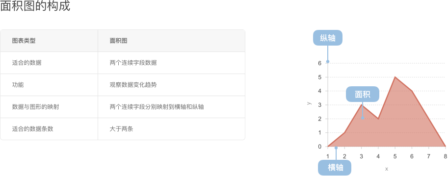

???
面积图适合展示时间维度上的变化值，例如股票市场上某股的逐日收市价，用面积图（或者折线图）可以展示大致上的趋势。当有多个数据组时，用面积图也能做很好的对比，面积重叠时，需要配好颜色，否则展示出错误的数据，误导用户。在此基础上，对于负值的表现，面积图效果会特别的明显。面积图不适合不连续或者不同分类间的数值比较，此时用柱状图较好。

---
name: Pie1
class: center

### 饼图

???
饼图广泛得应用在各个领域，用于表示不同分类的占比情况，通过弧度大小来对比各种分类。饼图通过将一个圆饼按照分类的占比划分成多个区块，整个圆饼代表数据的总量，每个区块（圆弧）表示该分类占总体的比例大小，所有区块（圆弧）的加和等于 100%。

饼图可以很好地帮助用户快速了解数据的占比分配。它的主要缺点是：

饼图不适用于多分类的数据，原则上一张饼图不可多于 9 个分类，因为随着分类的增多，每个切片就会变小，最后导致大小区分不明显，每个切片看上去都差不多大小，这样对于数据的对比是没有什么意义的。所以饼图不适合用于数据量大且分类很多的场景。
相比于具备同样功能的其他图表（比如百分比柱状图、环图），饼图需要占据更大的画布空间。
很难进行多个饼图之间的数值比较。
尽管如此，在一张饼图上比较一个数据系列上各个分类的大小占比还是很方便高效的。

---
name: 
class: center

### 饼图

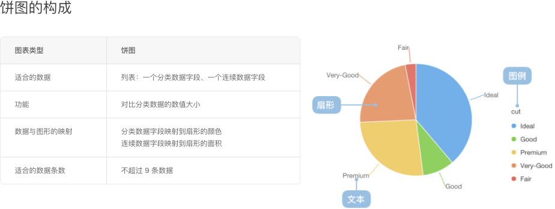

???
除了分类过多不适合饼图，如果分类数据及其相近，例如5个分类数据值都在20%左右，相差1%不到，使用饼图也无法观察出结果，此时可以改用柱状图来表示。

---
name: Donut1
class: center

### 环图

???
环图（又叫做甜甜圈图），其本质是饼图将中间区域挖空。

虽然如此，环图还是有它一点微小的优点。饼图的整体性太强，我们会将注意力集中在比较饼图内各个扇形之间占整体比重的关系。但如果我们将两个饼图放在一起，饼图很难同时对比两个图。

环图在解决上述问题时，采用了让我们更关注长度而不是面积的做法。这样我们就能相对简单的对比不同的环图。

同时环图相对于饼图空间的利用率更高，比如我们可以使用它的空心区域显示文本信息，比如标题等。

---
name: 
class: center

### 环图

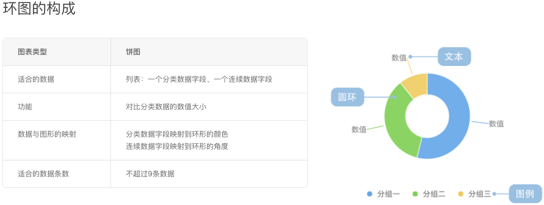

???
他和饼图一样，适合的场景和不适合的场景是一致的。但他的可视化维度是弧度（长度），因此它相对饼图来说，可以与其他环图进行对比或者分面查看。

---
name: Radar1
class: center

### 雷达图

???
雷达又叫戴布拉图、蜘蛛网图。传统的雷达图被认为是一种表现多维（4维以上）数据的图表。它将多个维度的数据量映射到坐标轴上，这些坐标轴起始于同一个圆心点，通常结束于圆周边缘，将同一组的点使用线连接起来就称为了雷达图。它可以将多维数据进行展示，但是点的相对位置和坐标轴之间的夹角是没有任何信息量的。在坐标轴设置恰当的情况下雷达图所围面积能表现出一些信息量。

每一个维度的数据都分别对应一个坐标轴，这些坐标轴具有相同的圆心，以相同的间距沿着径向排列，并且各个坐标轴的刻度相同。连接各个坐标轴的网格线通常只作为辅助元素。将各个坐标轴上的数据点用线连接起来就形成了一个多边形。坐标轴、点、线、多边形共同组成了雷达图。

着重要强调的是，虽然雷达图每个轴线都表示不同维度，但使用上为了容易理解和统一比较。使用雷达图经常会人为的将将多个坐标轴都统一成一个度量，比如：统一成分数、百分比等。这样这个图就退化成一个二维图了，事实上这种雷达图在日常生活更常见、更长用。 另外，雷达图还可以展示出数据集中各个变量的权重高低情况，非常适用于展示性能数据。

雷达图的主要缺点是：

(1) 如果雷达图上多边形过多会使可读性下降，使整体图形过于混乱。特别是有颜色填充的多边形的情况，上层会遮挡覆盖下层多边形。

(2) 如果变量过多，也会造成可读性下降，因为一个变量对应一个坐标轴，这样会使坐标轴过于密集，使图表给人感觉很复杂。所以最佳实践就是尽可能控制变量的数量使雷达图保持简单清晰。

注意：
(1) 为了使概念尽可能简单，且贴近现今的使用习惯，下面我们暂时只介绍退化为二维的雷达图。
(2) 雷达图更注重于同类图表之间的对比（即雷达图与雷达图之间的对比）

---
name: 
class: center

### 雷达图

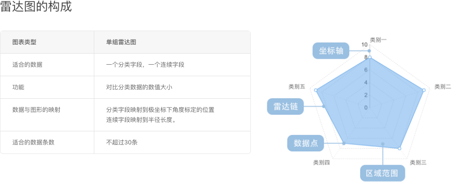

---
name: 
class: center

### 雷达图

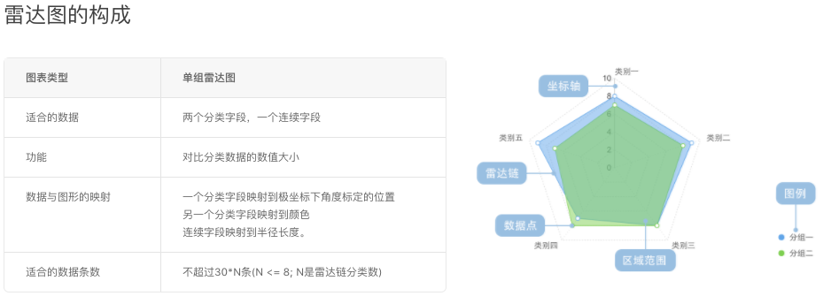

---
name: Polar1
class: center

### 极坐标 vs 直角坐标

  

  

???
前面我们大部分的图表都是基于笛卡尔平面直角坐标系的，后面出现了几个极坐标系的图表。极坐标在图表中应用也是相当广，如果使用得当，图表的表现将会比直角坐标系更加直观和美观。在从直角坐标系仿射到极坐标过程中，很多维度将丧失对比分析的能力，也容易造成视觉上的误差，所以实际运用过程中要慎用，不要为了审美而缺失了图表的实际表达能力。

比如说，左边的玉玦图和右边的柱状图，柱状图是用高度来表示占比值，而玉玦图是用角度来表示占比值。当人们习惯性的用长度这个视觉引导来观察玉玦图的时候，就会发现有偏差。而且当数值过小、整体差异不大或者数据无序时，玉玦图就更加不适用了。

---
name: Polar2
class: center

### 极坐标 vs 直角坐标

  

  

???
而有的时候我们可以使用极坐标图，例如右边的柱状图显示了几种游戏在当年的销量，虽然我们看到了数量上的区别，但仍然不能从宏观的角度上去看到占比情况，这时左边的饼图就能显而易见了。

4. 复盘： 每月月底举行一次复盘会议，会议内容即总结本月工作情况，主体为三个：做了哪些工作、遇到了哪些问题、有哪些知识和经验产出。会议不限于是否提前准备，只要问题得到解决，没有再犯或引发更大的问题即可终止。

