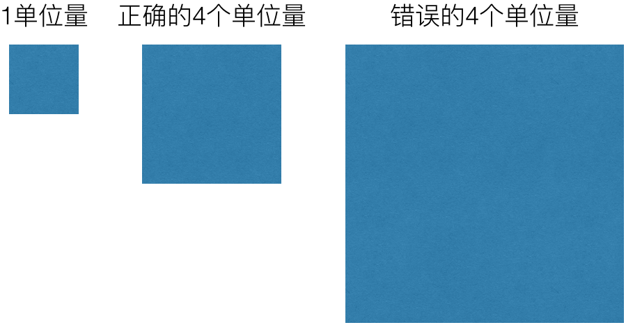
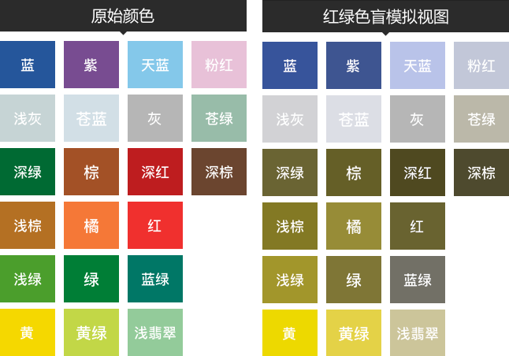
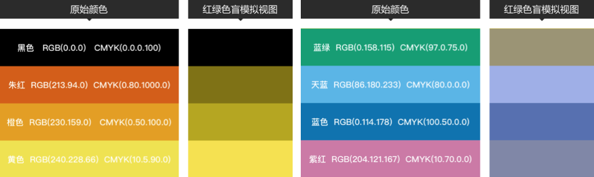
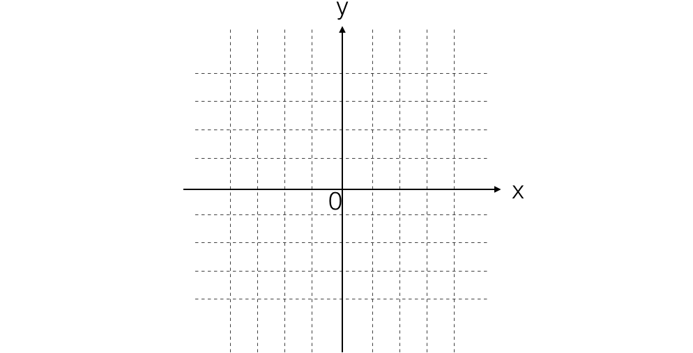
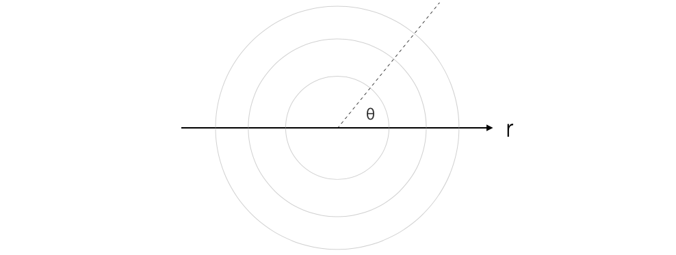
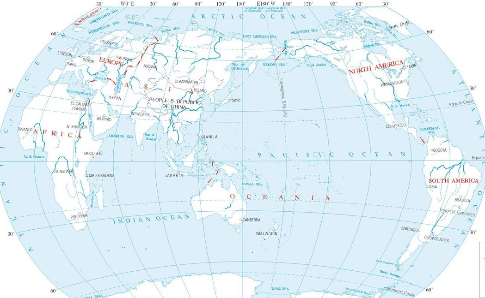
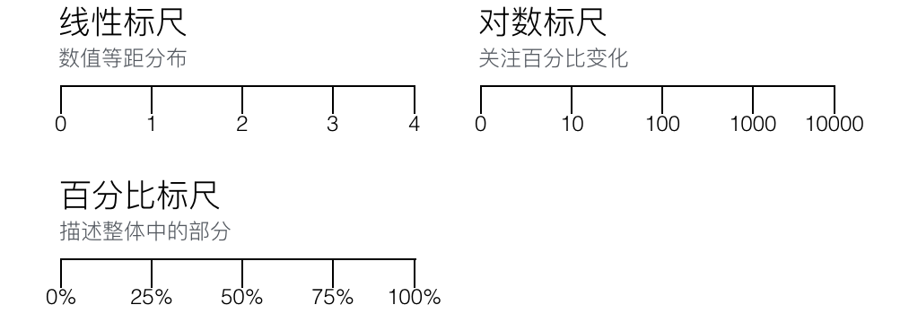
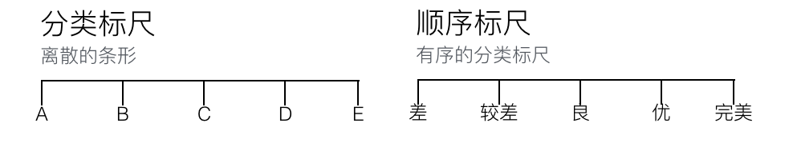

name: footer
layout: true

.footer[&copy;&nbsp;2017 HC System, Inc]

---
name: 
class: middle, center, inverse

# 可视化组件

---
name: 
class: 

# 可视化组件

* 视觉暗示
* 坐标系
* 标尺
* 注解

---
name:
class: middle, center, inverse

## 视觉暗示

---
name: Position1
class: 

## 视觉暗示（位置）

???
用位置作视觉暗示时，要比较给定空间或坐标系中数值的位置。例如，观察散点图的时候，是通过一个点的x坐标和y坐标以及和其他点的相对位置来判断一个数据点点。

只用位置作视觉暗示的一个优势是，他往往比其他视觉暗示占用空间更少。因为你可以在一个平面直角坐标系里画出所有数据，每一个点都代表一个数据。与其他用尺寸大小来比较数值的视觉暗示不同，坐标系中所有的点大小相同。然而，绘制大量数据之后，你一眼就能看出趋势、集群和离群值。

这个优势同时也是劣势。观察散点图中的大量数据点，很难分析出每一个点分别代表什么。即便是在交互图中，仍然需要鼠标悬停在一个点上以得到更多信息，而点重叠时会更不方便。

---
name: Position2
class: 

## 视觉暗示（位置）

???
用位置作视觉暗示时，要比较给定空间或坐标系中数值的位置。例如，观察散点图的时候，是通过一个点的x坐标和y坐标以及和其他点的相对位置来判断一个数据点点。

只用位置作视觉暗示的一个优势是，他往往比其他视觉暗示占用空间更少。因为你可以在一个平面直角坐标系里画出所有数据，每一个点都代表一个数据。与其他用尺寸大小来比较数值的视觉暗示不同，坐标系中所有的点大小相同。然而，绘制大量数据之后，你一眼就能看出趋势、集群和离群值。

这个优势同时也是劣势。观察散点图中的大量数据点，很难分析出每一个点分别代表什么。即便是在交互图中，仍然需要鼠标悬停在一个点上以得到更多信息，而点重叠时会更不方便。

---
name: Position3
class: 

## 视觉暗示（位置）

???
用位置作视觉暗示时，要比较给定空间或坐标系中数值的位置。例如，观察散点图的时候，是通过一个点的x坐标和y坐标以及和其他点的相对位置来判断一个数据点点。

只用位置作视觉暗示的一个优势是，他往往比其他视觉暗示占用空间更少。因为你可以在一个平面直角坐标系里画出所有数据，每一个点都代表一个数据。与其他用尺寸大小来比较数值的视觉暗示不同，坐标系中所有的点大小相同。然而，绘制大量数据之后，你一眼就能看出趋势、集群和离群值。

这个优势同时也是劣势。观察散点图中的大量数据点，很难分析出每一个点分别代表什么。即便是在交互图中，仍然需要鼠标悬停在一个点上以得到更多信息，而点重叠时会更不方便。

---
name: Position4
class: 

## 视觉暗示（位置）

???
用位置作视觉暗示时，要比较给定空间或坐标系中数值的位置。例如，观察散点图的时候，是通过一个点的x坐标和y坐标以及和其他点的相对位置来判断一个数据点点。

只用位置作视觉暗示的一个优势是，他往往比其他视觉暗示占用空间更少。因为你可以在一个平面直角坐标系里画出所有数据，每一个点都代表一个数据。与其他用尺寸大小来比较数值的视觉暗示不同，坐标系中所有的点大小相同。然而，绘制大量数据之后，你一眼就能看出趋势、集群和离群值。

这个优势同时也是劣势。观察散点图中的大量数据点，很难分析出每一个点分别代表什么。即便是在交互图中，仍然需要鼠标悬停在一个点上以得到更多信息，而点重叠时会更不方便。

---
name: Length
class:

## 视觉暗示（长度）

???
长度通常用于条形图中。条形越长，绝对值越大。不同方向上，如水平方向、垂直方向、或者圆的不同角度上都是如此。

如何形象的判断长度，长度是从图形的一端到另一端到距离，因此要用长度比较数值，就必须能看到线条的两端。否则得到的最大值、最小值及其间的所有数值都是有偏差的。

该图是一个简单的例子，它是一家主流新闻媒体在电视上展示的一副税率调整前后的条形图。左图中两个数值看上去有巨大的差异。因为数值坐标从34%开始，导致右边条形长度几乎是左边长度的5倍，从而导致视觉上误差很大。而右图中坐标轴从0开始，数值差异看上去就没有那么夸张。当然，你可以随时注意坐标轴，印证你所看到的，但这无疑破坏了用长度表示数值的本意，而如果图表在电视上一闪而过的话，大部分人是不会注意到这个错误的。

---
name: Angle1
class:

## 视觉暗示（角度）

???
角度的取值范围是0到360度，构成一个圆。

0到360度之间的任何一个角度，都隐含着一个能和它组成完整图形的对应角，这两个角被称为共轭（conjugates）。这就是通常用角度表示整体中部分的原因。虽然常遭到批评，但饼图还是颇受欢迎的。图中所有的楔形组成了一个完整的圆。

---
name: Angle2
class:

## 视觉暗示（角度）

???
小贴士：尽管圆环图（又称甜甜圈图）经常被当作是饼图的近亲，但环图的视觉暗示是弧长，因为可以表示角度的圆心被切除了。

---
name: Direction
class:

## 视觉暗示（方向）

???
方向和角度类似。角度是相交于一个点的两个向量，而方向则是坐标系中一个向量的方向。你可以看到上下左右及其他所有方向。这可以帮你测定斜率，在这张图中你可以看到增长、下降和波动。

对变化大小的感知在很大程度上取决于标尺，举例来说 你可以放大比例让一个很小的变化看上去很大，同样可以缩小一个比例让巨大的变化看上去很小。

一个经验法则是，缩放可视化图表，使波动方向基本都保持在45度左右。这并不是一个固定规则，你最好是从这个建议开始，根据实际情况进行调整。如果变化很小却很重要，就应该放大比例以突出差异。相反，如果变化微小且不重要，那就不需要放大比例尺使之变得显著了。

---
name: Shape
class:

## 视觉暗示（形状）

???
形状和符号通常被用在地图中，以区分不同的对象和分类。地图上的任意一个位置都可以直接映射到现实世界，所以用图标来表示现实世界中的事物是合理的。比如你可以用一些树表示森林，用一些房子表示住宅。

在图表中，形状已经不能像以前那样频繁地用于显示变化。在笔纸绘图、计算机还在用打孔卡片的时代，符号更易于区分不同的类别。例如该图中，三角形和正方形都可以用在散点图中，比起频繁地更换不同颜色的钢笔和铅笔，或者使用单色和交叉阴影线填充一个形状要快的多。不过，不同形状比一个个点提供的信息更多，而且通常用你最熟悉的软件就可以绘制。

---
name: Area
class:

## 视觉暗示（面积和体积）

???
大的物体代表大的数值。长度、面积和体积分别可以用在二维和三维空间中表示数值的大小。二维空间通常用圆形和矩形，三维空间一般用于立方体或球体。你也可以更为详细地标出图标和图示的大小。

一定要注意你用的是几维空间。最常见的错误就是只使用一维（例如高度）来度量二维、三维的物体，却保持了所有维度的比例。这会导致图形过大或过小，无法正确比较数值。

假设你用正方形这个有宽有高两个维度的形状来表示数据。数值越大，正方形的面积就越大。如果一个数值比另一个大50%，你希望正方形的面积也大50%。然而很多软件的默认行为是把正方形的边长增加50%，而不是面积，这会得到一个非常大的正方形，面积增加了125%，而不是50%。这是一种明显的跳跃式差距。三维物体也有同样的问题，并且会更佳明显。

---
name:
class:

## 视觉暗示（颜色）

???
颜色就比较复杂了，它包含色相、饱和度、明度。他们分开使用，也可以结合起来使用。色相就是通常所说的颜色，例如：红橙黄绿青蓝紫等。不同的颜色通常用来表示分类数据，每一个颜色代表一个分组。饱和度是一个颜色中色相的量，也就是纯度。假如选择红色，高饱和度的红色就比低饱和度看起来更浓。明度用于表示颜色所具备的亮度和暗度，明度更高的颜色会比明度低的颜色看起来更亮，反之明度低的颜色会看起来更灰。三个维度同时使用的话，不仅能表示不同的分类，还能在每个分类中表示不同的等级。

但对于颜色的使用要谨慎使用，一方面要考虑适应人群，例如色盲和视觉障碍人群；另一方面颜色的编码本身就过于复杂，通常我们可以在网上搜集一些好的颜色组合即可。

---
name:
class:

## 视觉暗示（颜色）

???
颜色就比较复杂了，它包含色相、饱和度、明度。他们分开使用，也可以结合起来使用。色相就是通常所说的颜色，例如：红橙黄绿青蓝紫等。不同的颜色通常用来表示分类数据，每一个颜色代表一个分组。饱和度是一个颜色中色相的量，也就是纯度。假如选择红色，高饱和度的红色就比低饱和度看起来更浓。明度用于表示颜色所具备的亮度和暗度，明度更高的颜色会比明度低的颜色看起来更亮，反之明度低的颜色会看起来更灰。三个维度同时使用的话，不仅能表示不同的分类，还能在每个分类中表示不同的等级。

但对于颜色的使用要谨慎使用，一方面要考虑适应人群，例如色盲和视觉障碍人群；另一方面颜色的编码本身就过于复杂，通常我们可以在网上搜集一些好的颜色组合即可。

---
name: 
class: middle, center, inverse

# 坐标系

---
name:
class:

## 坐标系（直角坐标系）

???
直角坐标系是最常用的坐标系。如果你用过条形图或者散点图，就已经接触过直角坐标系了。通常可以认为坐标就是标记为（x，y）的XY值对。坐标的两条线垂直相交，取值范围从负到正，组成了坐标轴。交点是原点，坐标值指示到原点的距离。直角坐标系还可以像更多维度空间扩展，例如：三维空间可以用（x，y，z）三值来表示。从现实的角度来看，坐标系可以帮助你把数据编码输出到纸上或任何显示设备上。

---
name:
class:

## 坐标系（极坐标系）

???
如果你用过饼图的话，那你就相当于用过极坐标系了。尽管你可能只用到了角度，还没有用到半径。极坐标由圆形网格构成，最右边的点是0度，角度越大，逆时针旋转越多，距离圆心越远，半径也就越大。

极坐标没有直角坐标系用的多，当角度和方向很重要的时候用它会更有用。

---
name:
class:

## 坐标系（地理坐标系）

???
位置数据的最大好处就在于它与现实世界的联系。这反过来能给相对于你的位置的数据点带来即时的环境信息和关联信息。用地理坐标系可以映射位置数据。位置数据的形式有很许多种，但通常都是用经纬度来描述，分别对应赤道和子午线的角度，有时还包含高度。

纬度线是指东向西的，标识地球上的南北位置。经度线是南北朝向的，标识东西位置。高度可以被视为第三个维度，在电子沙盘中比较常用。相对于直角坐标系，维度就相对于水平轴，经度就好比垂直轴。也就是说，相当于使用了平面投影。

然而，当你把一个三维物体投射到二维平面上时，会丢失一些信息，于此同时，一些重要信息能被保留。例如，麦卡托投影法在局部区域保持角度不变（等角）。它是由地图学家麦卡托于16世纪发明的，主要用于绘制航海地图，目前仍是在线地图使用最多的投影法。亚尔伯斯投影保持面积不变，但形状改变了。你关注的焦点决定了选择哪种投影法比较好。

其他投影：等距圆柱投影、等角圆锥投影、正弦投影、圆锥投影、温克尔投影、罗宾森投影、正投影等。

---
name:
class: middle, center, inverse

## 标尺

???
维度指定了可视化的维度，而标尺则指定了每个维度里数据应该映射到哪里以及范围。标尺有很多种，你也可以用数学函数定义自己的标尺，但基本不会偏离以下这几种：线性标尺、对数标尺、分类标尺、顺序标尺、百分百标尺、时间标尺。这些标尺大致可分为三类：数字标尺、分类标尺、时间标尺。

---
name:
class:

## 标尺（数字标尺）

???
数字标尺上显示的数字都是数列，例如等差数列的线性标尺，平方数列的对数标尺。

线性标尺上的间距处处相等，无论处于坐标轴的生命位置。因此，在标尺的低端测量两点的距离，和在标尺高端测量的结果是一样的。然而，对数标尺是随着数值的增加而压缩的。对数标尺不像线性标尺那样被广泛使用。对于不常和数据打交道的人来说，它不够直观，也不好理解。但如果你关心的是百分比变化而不是原始计数，或者数值范围很广，对数标尺还是很有用的。

比如，当比较美国各州人口时，处理的数据少则十万，多则千万。例如加利福利亚州将近3800万人口，而怀俄明州只有60万人口。如图，用线性标尺，人口少的州几种在底部，少数几个州位于顶部。而用对数标尺的话，则更容易看清位于底部的点。

百分比标尺通常也是线性的，用来表示整体中的部分时，最大值时100%。如图所示，所有的部分总和时100%。很明显，饼图中所有部分的百分比总和不能超过100%，但是偶尔也会出错，有时是因为标记错误，有时是因为制作者对这个图不熟悉。

---
name:
class:

## 标尺（分类标尺）

???
数据并不总是以数据呈现的。它们也可以进行分类的，比如人们居住的城市、日用品的品类。分类标尺位为不同的分类提供视觉分隔，通常和数字标尺一起使用。拿柱状图说，你可以在水平轴上使用数字标尺，在水平轴上使用分类标尺，这样就可以显示不同分组的数量大小了。

分类间的间隔是随意的，和数值没有关系。通常会为了增加可持续性而进行调整。

顺序和数据背景信息相关，当然也可以是随意的，但对于分类的顺序标尺来说，顺序就很重要了。比如，将电影的分类排名数据按照从最糟糕的到非常好的这种顺序显示，能帮助用户更轻松地判断和比较影片质量。

---
name:
class:

## 标尺（时间标尺）

???
时间是连续变量，你可以把时间数据画到线性标尺上，也可以将其分成月份或者星期这样的分类，作为分类标尺来处理。当然，它也可以是周期性的。

和读者沟通时，时间标尺带来了更多的好处，因为它和地理地图一样，时间是日常生活的一部分。随着日出和日落，在时钟和日历里，我们每时每刻都在感受和体验时间。

---
name:
class: middle, center, inverse

## 注解

???
注解，又称背景信息，能够帮助人们更好的理解数据的5W信息，即任人、何事、何时、何地、为何，使数据更清晰，并且能正确引导用户。

有时注解信息是直接画出来的，有时则隐含在媒介中或者文字。当你很难用文字注解去描绘背景信息时，可以尝试使用别的方式来代替。最容易最直接的方法就是标注坐标轴、制定度量单位，或者直接告诉用户每一个视觉暗示表示什么。否则，数据抽象出来之后，就无法理解形状、大小和颜色了，等同于显示了一团乱糟糟的东西。

至少你可以很容易的用一个描述性标题来让用户知道他们将要看到的是什么。想象一副呈上升趋势的汽油价格时序图，可以把它叫做“油价”，这样显得清楚明确。你也可以叫它“上升的油价”来表达图片等信息。你还可以在标题底下加上引导性文字，描述价格低浮动。

---
name: Annotation1
class:

## 注解

---
name: Annotation2
class:

## 注解

---
name:
class: middle, center, inverse

## 整合可视化组件

???
学会可视化技术的原材料的目的，就是在于能整合他们，像是学会了食材的特性，必要的要去做一顿大餐了。单独看这些可视化没那么神奇，它们只是漂浮在虚无空间里的一些几何图形而已。如果把它们放在一起，就得到了值得期待的完整的可视化图形。

举例来说，在一个直角坐标系里，水平轴上用分类标尺，垂直轴上用线性标尺，长度作为视觉暗示，这时你能想到什么？没错，就是条形图和柱状图。在极坐标系中，半径用百分比标尺，旋转角度用时间标尺，面积作为视觉暗示，可以画出玫瑰图。

现在我们可以回顾上一章的基本图看，看看他们都用到了哪些可视化组件。

---
name:
class: middle, center, inverse

## 小结

???
本质上，可视化是一个抽象的过程，是把数据映射到了几何图形和颜色上。从技术角度看，这很容易做到。你可以很轻松地用纸笔画出各种形状并涂上颜色。难点在于，你要知道什么形状和颜色是最合适的，画在哪里以及画多大。

要完成从数据到可视化的飞跃，你必须知道自己拥有哪些原材料。经验丰富的大厨不只是盲目的把食材都放到锅里再把炉火加旺，然后就可以等待美味可口的大餐出现。相反，他们知道应该怎样搭配这些食材，哪些东西不能一起烹调，以及最恰当的烹饪温度和时长。

对于可视化来说，视觉暗示、坐标系、标尺和注解信息都是你拥有的原材料。视觉暗示是人们看到的主要部分，坐标系和标尺使其结构化，创造出空间感，注解信息则赋予了数据以生命和意义，使其更贴切更容易呗理解，从而更有价值。

知道了每一个部分是如何发挥作用的，尽情发挥，并观察别人看图时得到了什么信息。但也不要忘了最重要的东西，没有数据，一切都是空谈。同样，如果数据很空洞，得到的可视化图表也会很空洞的。即使数据提供了多维度的信息，而且粒度足够小，使你能观察到细节，那你也必须知道应该观察些什么。

数据量越大，可视化的选择也就越多，然而很多选择可能不适合。为乐过滤掉那些不好的选择，找到合适的方法，得到有价值的可视化图表，你必须了解自己的数据。

