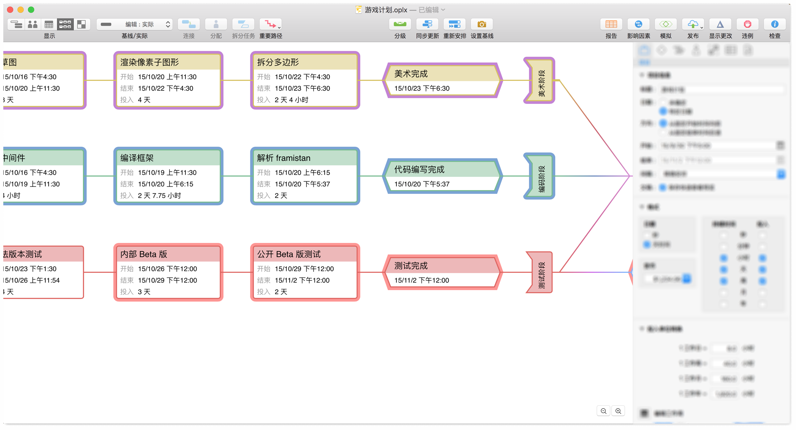
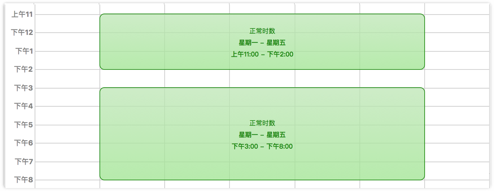
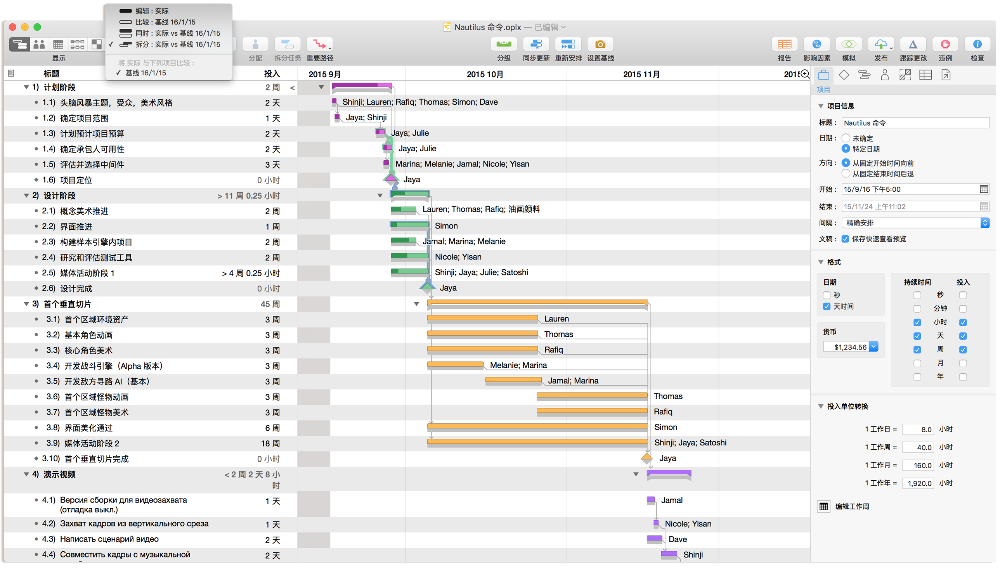
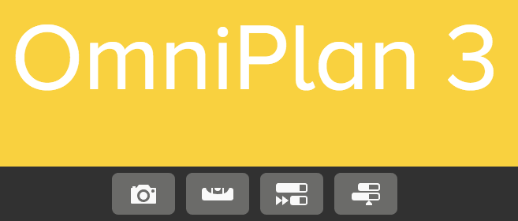

name: footer
layout: true

.footer[&copy;&nbsp;2017 HC System, Inc]

---
class: center, middle
background-image: url(omniplan_background.png)
background-size: contain
background-position: center
 
 
 
 
 
 
 
 
 
 
 
## 简介及教程

???
OmniPlan for  Mac 其功能相当windows下的Microsoft Project ，但OmniPlan更加美观、易用、功能强大！

The Omni Group是一个专门为Mac、iPad和iPhone开发应用程序的公司。它全方位独特的生产力类软件获得了三次Macworld Editors' Choice大奖。旗下的OmniPlan for Mac可以说是排名第一的项目管理软件，功能强大的同时操作非常简单，界面又非常美观。如果你想学习并提高项目管理能力，项目管理软件是必备的，而对于使用Mac的朋友来说，OmniPlan是最佳选择！

一些人在接手大型项目的时候，发现以往通过Word、Excel管理项目的方法逐渐有些吃力。最初使用OmniPlan for Mac的目的是让原本Excel上做的甘特图漂亮一些，可用了一段后发现，甘特图只是OmniPlan for Mac的基础功能，更深层的含义是成本管理、资源分配、进度控制，而项目管理中这几项影响着项目的成败。

通过使用OmniPlan for Mac，可以让你对项目管理的理解有全方位的提示，让你更好的掌控项目，提高项目成功率，取得商业上的成功！

---
class: center, middle
background-image: url(omniplan_background.png)
background-size: contain
background-position: center
 
 
 
 
 
 
 
 
 
 
 
## 了解OmniPlan

???
首次启动 OmniPlan 时，会看到一个新建的 OmniPlan 文档。您可以将它按手上的项目要求进行填充，从而精确地满足需求。接下来会出现对应用程序各组件的介绍，以便您今后利用这些组件来按自己的特定需求构建项目。要跳过介绍直接开始工作，请参阅教程。

---
### 工具栏

    
.img100[]
      
.img100[]

???
正如大多数应用程序一样，工具栏中具有您最常使用的命令。我们预设了一组便于众多 OmniPlan 用户使用的控件，不过您也可以通过“显示▸“自定工具栏”来随意添加和删除控件。
  
工具栏还可选择搭配概览使用，这是一条水平栏，当您选择了“显示”▸“显示概览”时，上面会出现甘特图的浓缩视图。不论当前处于哪种视图，都可以通过概览方便快捷地观察整个项目。
  
在任务和资源视图中，概览栏上还有另一种用于浏览项目的控件选择框，只需要拖动该选择框就能在主视图的甘特图或资源时间线上滚动。

---
### 任务视图

.img90[]

???
请单击视图控件上的第一个按钮以转到任务视图
  
任务视图由两个部分组成：左侧是任务大纲，右侧是甘特图。您可使用任务大纲来快速创建、编辑和分组相关的任务，而甘特图则能够以清晰的图形详细展示任务的持续时间和其之间的关系。

---
### 资源视图

.img90[]

???
请单击视图控件上的第二个按钮以转到资源视图。
  
使用资源视图来添加管理人员、设备和材料。与任务视图一样，资源视图也分为两个部分：一个用于添加、分组和管理资源的大纲，以及一条显示与任务视图中相同的任务的时间线。但在后者中，任务的划分依据是资源分配，而非时间或关联性。您可以通过拖放的方式在资源和任务之间相互分配。

---
### 日历视图

.img90[]

???
请单击视图控件上的第三个按钮以转到日历视图。。
  
日历视图也由两个部分组成：一份类似资源视图的大纲的项目资源列表，以及一幅可用于编辑工作时间的日历。日历视图还可以进一步分成两种模式：编辑“正常时数”，以及编辑“额外和非工作时数”。
在正常时数模式下，您可以编辑整个项目的工作日历（未选定资源时），以及各工作人员的常规工作时间（在大纲中选定他们）。正常工作时间在日历中由绿色块表示。用额外和非工作时数模式来对计划表添加独立的变更，分别由蓝色（额外工作时数）和红色（非工作时数）表示。

---
### 网络视图

.img90[]

???
请单击视图控件上的第四个按钮以转到网络视图。
  
OmniPlan 3 中新增的网络视图可以将项目显示成一组节点（任务）图，节点之间用线条（相关性）连接。网络视图因通过 PERT 技术生成的图表而非常直观，不仅能为当前的项目带来全新的观察角度，也便于迅速地构建新的项目。选中一个任务后按回车键可创建一个与该任务相关的新任务；拖动现有任务之间的线条，可以看到这些线条会根据新创建的相关性进行调整。

---
### 样式视图

.img90[]

???
请单击视图控件上的第五个按钮以转到样式视图。
  
样式视图是 OmniPlan 3 中新增的视图，但对于使用过旧版本的用户而言并不陌生，因为能够控制项目整体的一切样式控件都转移到了此处。更改此处的默认选项可以更新整个文档中的各元素的外观，如字体、颜色、甘特图中的条的外观等。您还可以在此创建和管理自定义的“已命名样式”来用于临时修改个别项目的样式。

---
### 检查器

.img75[]

???
OmniPlan 窗口的右侧是检查器侧边栏。如果未显示，选择“检查器”▸“显示/隐藏检查器”(Shift-Command-I) 或拖动窗口右侧来使其出现。
  
检查器是一系列窗格，其中包含与主窗口中所选项目相关的信息和控制项。具体某个检查器是否与当前的选择相关取决于检查器本身；您随时可以浏览所有七个检查器组（项目信息、里程碑、任务、资源、样式、自定义数据和附件）来查看哪些项目可以修改。

---
### 报告窗口（专业版）

.img55[]

???
虽然 OmniPlan 的主要窗口中不一定包含报告界面，但它在 OmniPlan 专业版中非常重要，因此值得在此一提。使用“文件”▸“报告…”(Option-Command-R) 来将其打开。
  
设置好项目并开始运行后，您可以在此随时视图化其并进行总结。窗口顶部的一系列选项卡提供一系列用于展示项目状态数据的选项，从整个项目的概览到着眼于任务和资源的专项报告应有尽有。
而且您还可以直接在该窗口中使用漂亮的预设模板或自定义的 HTML 模板打印所选的报告。

---
### 仪表盘（专业版）

.img65[]

???
多项目仪表盘是将 OmniPlan 3 升级到专业版后可得的功能，它能让您以全新的方式同时查看一系列项目。要创建新仪表盘，可选择“文件”▸“新建仪表盘” (Shift-Command-N) 然后将 OmniPlan 项目拖放到其上
  
您可以将仪表盘保存为其独有的 .opld 文件格式以备将来使用，并能用更多的仪表盘文件随心所欲地创建独一无二的项目组合。当您对共享到仪表盘的某个项目作出任何更改时，更改都会立即在仪表盘中反映出来，但不能在仪表盘界面上直接编辑项目本身。

---
class: center, middle
background-image: url(omniplan_background.png)
background-size: contain
background-position: center
 
 
 
 
 
 
 
 
 
 
 
## 使用教程

???
（如果急切地想设置并运行您的第一个 OmniPlan 项目，可以按这章中的说明操作。该教学课程指导您完成从创建第一个任务到实现最后一个里程碑的项目设置和维护流程。完成该流程之后，您将获得所需工具以从头开始构建自己的项目。）
  
欢迎来到本教程！我们将从零开始组建一个项目，从而通过实际应用来展示 OmniPlan 的所有核心功能。
我们将一款游戏的开发流程作为本教程的示例，从中了解在从初期规划到发布试玩视频的过程中，一支勇于探索的独立制作团队中的设计师、程序员和测试人员在是如何共同进行游戏制作的。

---
### 步骤 1：创建项目

    
.img100[]

???
要创建新项目，请选择“文件”▸“新建” (Command-N)。

---
### 步骤 1：创建项目

.img70[]

???
会出现一个带有一项任务的新项目文稿。将文件保存 (Command-S) 到便于查找的位置并命名（此处名为 Nautilus Command，即将要开发的游戏项目的代号）。

---
### 步骤 2：选择日期

.img55[]

???
构建项目时，最重要的考虑因素之一是时间安排。而时间安排则取决于项目的任何截止日期或启动时限。
  
在这里的游戏开发示例中，我们没有明确的项目截止日期，何时达到成品要求则何时结束（当然是在合理的范围内）。为此，我们将在项目检查器中将起始日期设置为今天。
  
这对于任何新项目而言都是默认设置，方便使用。
  
注意:如果您正在规划的项目尚处于构思阶段，没有明确的起始和结束时间，在确定时间安排之前可以将日期从特定更改为未确定。您将转而获得显示为 T+1天、T+2天… 的日期。
  
如果正在规划的项目有非常严格的截止日期，可以将方向从向前改为向后，并在结束字段中输入截止日期。任务会从该日期开始向回安排，逐一填充从项目完成日回溯到今天的这一时间范围。

---
### 步骤 3：创建里程碑

.img55[]

???
里程碑是项目中的分界点，标志着专注对象的重大变更或者新阶段的开始。明确定义这些里程碑可以将看似难以着手的巨大项目分割成多个更容易掌控的阶段，并帮助确定里程碑前后需要进行的任务。
  
要创建里程碑，在“结构”菜单中选择“结构”▸“添加”▸“里程碑”，或按快捷键 (Command-Shift-M)。
  
此外，也可以单击当前存在的任务（“任务 1”）来将其选中，然后打开任务检查器。您可以在此处的“任务信息”部分中将普通任务的任务类型更改为里程碑。

---
### 步骤 3：创建里程碑

    
.img100[]

???
我们可以在任务视图中单击“任务 1”的名称来更改名称，或者在任务检查器中编辑名称字段。先为我们的项目创建更多的里程碑，然后为这些里程碑设置任务。

---
### 步骤 4：创建任务

.img55[]

???
选中一个任务并按下 Return 键，或选择“结构”▸“添加”▸“任务”。要在当前所选任务的上方添加一项任务，可先按住 Shift 再按 Return。
  
所谓任务，就是必须完成以使项目向前得以顺利完成的任何事情。每个任务都有其属性（例如，开始和结束日期、完成百分比和资源分配），这些属性会在任务大纲的不同栏和任务检查器的不同部分中显示。任务可以组合到一起；一个任务也可以从属于其他任务。
  
在这里我们先创建一些任务并对其进行命名。选择您的第一个任务，并按一次 Return 键（或两次，取决于您键盘预置的设置方式）创建新任务。如果还有一个”任务 1″，则可以将其删除，或者更改其名称。当您完成时，如果您的里程碑不是最后一个项目，则点按左边的项目符号，将其向下拖移到清单的底端。
  
大纲中的每个任务都与甘特图上的任务条相对应。
  
在甘特视图中，新任务会出现在当前选定的项目下方，如果没有选中任何任务、里程碑或群组，则会出现在列表底部。
  
在我们的项目中，需要在各个里程碑下创建数个与之相关的任务。
  
注：创建额外的任务时，会看到任务名称出现在大纲中，与其他默认栏并存（违例、备注和投入）。您可以点击各任务旁边的备注图标来为其添加详情。投入代表完成任务所需的资源小时数，违例则仅在任务之间的关联性存在逻辑谬误时出现。

---
### 步骤 5：编辑工作周

.img80[]

???
项目已经大致成型，接下来我们将转而开始为项目设定工作安排。
切换到日历视图。默认情况下，工作时间是周一到周五上午 8:00 到下午 5:00，中午有一小时的午餐休息时间，不过您可以移动区块或调整其大小来调整项目的工作时间。
  
拖移区块可以将其移动，拖动区块的边缘可以调整其大小。在空白区域连按并拖移可以创建新的区块，或选择区块并按下 Delete 键可以去掉区块。每个区块中的文字都会更新，以反映您进行的更改。

---
### 步骤 5：编辑工作周

  
.img100[]

???
由于我们的开发人员中夜猫子比较多，所以需要相应地变更一下计划表。拖动日历上的某个时间区块可将其移动到其他位置，或者拖动其边缘来变更区块的大小。最后我们便得到了符合我们需要的计划表：
  
注：如果您的平均工作日不是 8 小时，则应该访问项目检查器的投入单位转换部分并更改每天时数设置，这样您的任务持续时间才会有效

---
### 步骤 6：设置计划表例外

.img70[]

???
再周全的工作周也偶尔会出现异常的日子。这可能是法定节假日、全体培训讲座、行业展览或会议，也可能仅仅是因为坏天气而导致大家无法上班。因此，对常规工作计划表设置例外对于保证项目进度是非常重要的。
  
仍然在日历视图中，从资源列表下面的切换中选择额外和非工作时数。在此可以更改特定周的工作时数，以便计算例外（例如，节假日或加班）。

---
### 步骤 6：设置计划表例外

.img80[]

???
想想看，未来我们将会在11月 26日有项目要执行，而那天和之后一天则是假日。我们可以将这一节假日增加到我们的计划表中。用括住当前月份的箭头来转到十一月，然后单击 26 日那一周，可打开该周的意外日历。

---
### 步骤 6：设置计划表例外

.img80[]

???
要快速从计划表中移去工作时间，则可以按住 Shift 键进行拖移，创建一个将正常工作时间标记为不可用的红色方框。
  
要添加额外时数，请连按并拖移以创建一个蓝色方框，表示正常工作时数之外的可用时数。
  
我们知道 26 日和接下来的 27 日周五应该休息，但也预见到这一周对于开发团队而言正是关键时刻。我们创建了包括 26 日和 27 日的时间区块，并在该周的前几天增加加班时间来补上缺失的时间。
  
注：为整个项目的时间表作出变更时，请务必注意不要在侧边栏中选中任何资源。如果选中了某个资源后编辑日历，则只会变更该资源的时间表而非整个项目的时间表（请参阅步骤 12：个别设置计划表例外了解如何操作）

---
### 步骤 7：设置任务持续时间

      
.img100[]

???
此时我们可以开始计划每项任务的持续时间。
  
使用视图切换，回到任务视图。完成每项任务都要花费一定的时间。您可以在任务大纲的“持续时间”栏中键入时间，或点按并拖移甘特图中任务条右侧末端的凸起处，来设置任务的持续时间。键入持续时间时，可以使用单位缩写，例如 2天、1周 等。
  
甘特图中任务条的长度表示持续时间。

---
### 步骤 8：分组任务

      
.img100[]

???
当某些任务关系密切或相互依赖时，将它们划入一个群组会很有用。群组可帮助在概念上对项目进行归纳，还可以作为一项大任务通过相关性与其他任务或群组进行关联。

---
### 步骤 8：分组任务

.img80[]

???
选择数个任务，然后单击“结构”▸“群组”(Option-Command-L) 来将其分组。分组到一起的项目会在大纲中体现出来，并由一个“群组”类型的父任务代表（可像其他任务一样重命名）。
  
选中群组中的所有任务后，最好再为群组增加一点视觉效果以便区分。打开样式检查器并选择一个用于标记该群组中所有任务的颜色。

---
### 步骤 8：分组任务

.img80[]

???
将任务和里程碑归入到群组中并估算了其完成时间后，就能更好地预估到项目的成型过程。到此阶段，我们的甘特视图看上去将如下所示：
  
注：在上图中，甘特图的比例已从天变更到了周，这样可以更清楚地看出分配给各任务的相对持续时间。要变更甘特图的比例，双指点击日期条并选择一个时间单位，或左右拖动日期条进行微调。

---
### 步骤 9：使用关联线连接任务

      
.img100[]

???
我们不可能同时完成所有的任务！即使有资源做到这点，项目的某些部分也需要等到其他部分完成后才能开始。还好，现在我们已经完成了相应的准备工作，可以根据各个任务对其他任务的状态的依赖性构建关联了。总共有四种关联性：
  
完成 ▸ 开始 是最常见的类型，即当任务 A 完成后，任务 B 才能开始。
  
开始 ▸ 完成 关联表示当任务 A 开始时，任务 B 才能完成。
  
开始 ▸ 开始 关联表示当任务 A 开始时，任务 B 才能开始。
  
完成 ▸ 完成 关联表示当任务 A 完成时，任务 B 才能完成。
  
选择需要连接的两个任务，然后点按工具栏中的“连接”按钮。“完成 ▸ 开始”关联线会出现在这两个任务之间，起点是大纲中先出现的任务。也可以直接在甘特图中绘制关联线，方法是单击所选任务结束端的箭头并将其拖到下一个任务的起始端。
  
注：相关性类型基于箭头的开始点和结束点：从一个任务的完成处将箭头拖至另一个任务的开头，将创建完成 ▸ 开始相关性等。连接时，任务会自动重新安排，以符合相关性。

---
### 步骤 9：使用关联线连接任务

.img90[]

???
里程碑与其他类型的任务一样可以用关联线连接。如果发现任务在甘特图中的位置不佳，没有达到其相关性所表达出的效果，可以在大纲中拖动其行来纵向重新安排它们，使其流程更加自然。
  
通过选择所有相关任务并单击“连接”工具栏按钮下拉菜单中的“结构”▸“断开任务” (Control-Command-减号) 或断开，可以移除关联性。

---
### 步骤 10：创建资源

.img90[]

???
接下来，我们应添加完成项目必需的团队成员、设备及材料。能够帮助完成项目的所有人、基础设备和原材料都是资源。接下来我们就开始操作。

---
### 步骤 10：创建资源

.img70[]

???
创建资源的方式与创建任务的方式非常类似。切换到包含资源大纲的资源视图。创建新资源（只需要按 Return）并将其命名。然后单击每个资源的“类型”图标，并在人员（团队成员）、设备（一件设备）或材料（耗材）中进行选择。与任务一样，资源也可以存在于分层的群组中。
  
您每创建一个资源，视图右侧都会出现相应的时间线，但在您为某些任务分配资源之前，其一直为空。
  
与任务大纲一样，资源大纲中除资源的名称和类型外还包含数个预设栏（如上所述）。备注可用于方便地记录资源的详细信息（如人员的工作职位），而单位则代表项目中空闲资源所占的百分比。
  
除了对资源添加备注，此时也是考虑成本的好时机。将小时成本和使用成本栏添加到资源大纲中，并输入相关的成本信息（如团队成员的时薪），这可以帮助我们在将资源分配给任务时规划项目预算。
  
注：人员资源的另一个有用的属性是电子邮件地址，这可以在资源查看器的“信息”部分中设置。人员的电子邮件地址将在其参与的所有项目中被用作唯一的标识，因此在平衡多个项目的工作量或在 OmniPlan 专业版的仪表盘中对比项目时尤其重要。

---
### 步骤 11：分配资源

.img80[]

???
您可以在任务视图或资源视图中为任务分配资源。
  
在任务视图中，您可以选择任务，然后使用任务检查器的“分配”部分选择应为其分配哪些资源。
  
或只需单击工具栏中的分配按钮来打开弹出式菜单。
  
在资源视图中，可以通过将任务从“未分配”时间线（或侧边栏）拖动到资源的时间线来分配任务。

---
### 步骤 11：分配资源

.img80[]

???
开始向任务分配资源时，您会注意到某些任务的持续时间在甘特图上出现明显的变化。这是由持续时间与投入之间的关系造成的。投入是指完成任务所需的资源小时数，而持续时间是任务分配到的资源完成该任务实际需要的时间。如果将多个人员的所有时间都分配给一项任务，其实际所需时间会比原来分配的时间少。
  
注：在构建关联性与资源的关系时，会意识到一个可能存在问题的地方：我们请的乐手 Jeremy 上还有其他工作，因此他能用于我们的游戏的时间只有 30%。这样一来，本来只需两周完成的工作会耗时六周以上。为了避免这一延误，我们可以让他将开工时间提前，或者想法让他为我们的项目分配更多的时间。

---
### 步骤 12：个别设置计划表例外

.img70[]

???
各个员工都可能有自己的工作安排，而且他们对休息时间的要求也多半各不相同。在日历视图中，在侧边栏中选择一项资源并像为项目整体一样为该资源创建每周工作计划表，然后从资源列表下面的切换按钮中选择额外和非工作时数并为例外重复该流程。
  
在这里我们为项目经理 Jaya 修改了休息时间，让她能有一天时间来庆祝她的结婚纪念日。

---
### 步骤 13：分级资源

.img90[]

???
当在日历中分配好工作时间，设置好一系列任务和里程碑并确定了一组拥有必要的工具完成任务的人员后，OmniPlan 还可以通过称为分级的过程来优化工作效率。
  
资源分级会分析您的项目，计算出最有效的资源安排方式，并考虑类如相关性和可用资源量等事情。
  
如果您手动更改了计划表，如重新安排未完成的任务、设置相关性或更改资源分配，则应该重新分级项目，以确定资源的使用是平衡的。
  
要对项目的资源工作量进行分级，可在工具栏中单击分级或单击“项目”▸“分级资源” (Shift-Command-L)。出现分级对话框，其中的选项可用于自定义分级过程；我们先暂时保持默认设置并单击“确定”。
  
除非工作人员已经实现了最佳配置，否则您就会看到甘特视图中的任务会发生变动以最有效地利用您的资源的时间。
  
注：您可以将 OmniPlan 设置为在您每次对项目作出变更后自动对资源进行分级，从而动态地响应项目的更新。如果要进行此设置，可在“项目”菜单中启用自动分级。

---
### 步骤 14：设置基线

.img85[]

???
设置了任务并分配和分级了资源后，就可以预见到项目在最理想的状况下的发展了，即在没有未知问题拖延进度且一切预估均得出了最佳结果的前提下的开发结果。
  
我们可以将这中理想状况设置为进度的基线，用于对比项目的实际进展与预期，从而相应地对里程碑和资源分配进行调整。
  
当您已正确设置和分级计划表，并且项目已准备就绪时，可以单击“项目”▸“设置基线”。此操作会拷贝您创建到基线计划表的计划表。即使您更新实际的计划表，基线计划表也不会更改；随着项目的继续，您可以记录项目按原始计划执行的情况。
  
您可以在工具栏上的“基线/实际”菜单中选择分割或两者来比较基线计划表与实际计划表。

---
### 步骤 15：查看重要路径

.img90[]

???
选择“显示”▸“自定工具栏”可在工具栏上添加“重要路径”按钮。

---
### 步骤 15：查看重要路径

.img90[]

???
工具栏中的“重要路径”按钮可以突出显示能够决定项目的持续时间的一系列任务和相关性（重要路径也可以针对特定的里程碑绘制，而非整个项目）。如果重要路径上有任何任务花费的时间多于或少于计划的时间，那么整个项目的持续时间也会更改。所以通常来说，这些任务最需要确保如期进行。
  
一个简单的线性项目的大部分任务都将位于重要路径上，因为它们几乎都在一个连续的链中。但对于存在多个资源并行工作的项目（如我们此处的示例项目），往往有些项目即使出现延误也不会影响最终完成时间。

---
### 步骤 16：更新任务完成情况

    
.img100[]

???
在项目的进行中，难免会有项目无法在最初计划的时限内完成。因此建议在 OmniPlan 中定期检查项目的进度，并根据情况变化对其进行相应的更新。
  
您可以通过在任务检查器的“已完成”栏或“任务信息”部分编辑百分比来更新各项任务的进度。或者直接拖移甘特图中任务条的完成情况控点。
  
如果每个任务都按计划进行，可单击同步更新工具栏按钮来将每个任务（或只是所选任务）的完成百分比更新到选定的日期。
  
如果有本来计划现在完成但却没有完成的任务，您可以点按重新安排工具栏按钮将其向前移动。请记得之后要分级项目 。

---
### 进一步深入

.img100[]

???
在理想情况下，项目管理只需要不断地追踪任务进度直至完成里程碑就行。但现实往往不可能如此顺利。因此，OmniPlan 也配备了随时应付任何突发情况的工具。
  
在开始将新项目与实际的工作环境磨合后，您有几种方式来确保项目平安地抵达最终的里程碑：
  
维护您的项目作为下一步工作内容是非常好的选择，在此我们将向您介绍各种用于解决常见问题的工具。
  
报告和打印在您需要将项目展示或转交给他人时也非常有用。
  
如果您的项目只是需要追踪的众多项目之一，或者还有其他相关人员负责项目的更新，可参考 OmniPlan 专业版的协作与多项目审核。

---

.left-column[
  ### 更多资源
]

.right-column[
  <iframe border="0" frameborder="0" scrolling="YES" seamless="YES" name="Iframe1" src="http://www.lichangtai.com/omnigroup/omniplan" width="100%" height="600" style="overflow-x:hidden;"></iframe>
]

