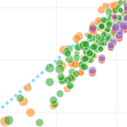
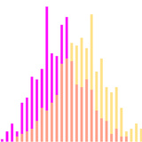
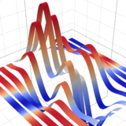

name: footer
layout: true

.footer[&copy;&nbsp;2017 HC System, Inc]
---
class: center, middle, inverse
template: footer

# Plotly.js 技术展示

### 前端数据可视化技术方案研究
---
template: footer
class: center, middle

## 为什么要用数据可视化

<table>
  <caption>Anscombe的四组数据</caption>
  <tbody>
    <tr>
      <th colspan="2">I</th>
      <th colspan="2">II</th>
      <th colspan="2">III</th>
      <th colspan="2">IV</th>
    </tr>
    <tr>
      <td>x</td>
      <td>y</td>
      <td>x</td>
      <td>y</td>
      <td>x</td>
      <td>y</td>
      <td>x</td>
      <td>y</td>
    </tr>
    <tr>
      <td>10.0</td>
      <td>8.04</td>
      <td>10.0</td>
      <td>9.14</td>
      <td>10.0</td>
      <td>7.46</td>
      <td>8.0</td>
      <td>6.58</td>
    </tr>
    <tr>
      <td>8.0</td>
      <td>6.95</td>
      <td>8.0</td>
      <td>8.14</td>
      <td>8.0</td>
      <td>6.77</td>
      <td>8.0</td>
      <td>5.76</td>
    </tr>
    <tr>
      <td>13.0</td>
      <td>7.58</td>
      <td>13.0</td>
      <td>8.74</td>
      <td>13.0</td>
      <td>12.74</td>
      <td>8.0</td>
      <td>7.71</td>
    </tr>
    <tr>
      <td>9.0</td>
      <td>8.81</td>
      <td>9.0</td>
      <td>8.77</td>
      <td>9.0</td>
      <td>7.11</td>
      <td>8.0</td>
      <td>8.84</td>
    </tr>
    <tr>
      <td>11.0</td>
      <td>8.33</td>
      <td>11.0</td>
      <td>9.26</td>
      <td>11.0</td>
      <td>7.81</td>
      <td>8.0</td>
      <td>8.47</td>
    </tr>
    <tr>
      <td>14.0</td>
      <td>9.96</td>
      <td>14.0</td>
      <td>8.10</td>
      <td>14.0</td>
      <td>8.84</td>
      <td>8.0</td>
      <td>7.04</td>
    </tr>
    <tr>
      <td>6.0</td>
      <td>7.24</td>
      <td>6.0</td>
      <td>6.13</td>
      <td>6.0</td>
      <td>6.08</td>
      <td>8.0</td>
      <td>5.25</td>
    </tr>
    <tr>
      <td>4.0</td>
      <td>4.26</td>
      <td>4.0</td>
      <td>3.10</td>
      <td>4.0</td>
      <td>5.39</td>
      <td>19.0</td>
      <td>12.50</td>
    </tr>
    <tr>
      <td>12.0</td>
      <td>10.84</td>
      <td>12.0</td>
      <td>9.13</td>
      <td>12.0</td>
      <td>8.15</td>
      <td>8.0</td>
      <td>5.56</td>
    </tr>
    <tr>
      <td>7.0</td>
      <td>4.82</td>
      <td>7.0</td>
      <td>7.26</td>
      <td>7.0</td>
      <td>6.42</td>
      <td>8.0</td>
      <td>7.91</td>
    </tr>
    <tr>
      <td>5.0</td>
      <td>5.68</td>
      <td>5.0</td>
      <td>4.74</td>
      <td>5.0</td>
      <td>5.73</td>
      <td>8.0</td>
      <td>6.89</td>
    </tr>
  </tbody>
</table>

???
1973年，统计学家F.J.Anscombe构造出四组奇特的数据。他告诉人们，在分析数据之前，描绘数据所对应的图像有多么的重要。<div></div>
这四组数据中，x的平均值都是9.0，y的平均值都是7.5；x值的方差都是10.0，y值的方差都是3.75；它们的相关度都是0.816，线性回归都是y=3+0.5x。单从这些统计数字上看，四组数据反映出来的实际情况都非常接近。然而事实上，这四组数据在经过可视化处理后就具备天壤之别。

---
template: footer
class: center, middle

## 为什么要用数据可视化


???
从描绘的图中我们发现，这四组数据呈现出完全不同的情况。<div></div>
第一组数据离散，振幅频次接近线性回归；<div></div>
第二组数据实际上是一个 二次函数，但我们错误的使用了线性模型；<div></div>
第三组数据描述了一个较为精确的线性关系，但有一个异常值；<div></div>
第四组数据则描述了一个更为极端的例子；<div></div>
<br/>
数据可视化是一个逐渐受到重视的领域。人们每天都在生产海量的是护具，但是海量的数据中依旧蕴含着无限的可能，越是大规模的数据，越是存在可以被挖掘的商业机会，我们可以出哦那个中分析出公司的库存走向、用户的行为习惯，甚至新兴行业机会的萌动。这些被分分析后得出的数据，成为我们改进和扩展 新领域的数据支撑。<s>而数据可视化，会让这个过程更加明晰吓具备说服力。</s>
由此可见，实现数据可视化不仅让数据变的通熟易懂，还能更加快捷、直接、精准的传达有效信息。<div></div>


---
template: footer
class: center, middle, inverse

## 交互方式

???
现在技术背景下的数据收集，具有良好的精准性，采用新的软件技术及手段，不仅让人们更加容易获得庞大数据，还能挖掘其隐藏的数据目标——信息。在数据可视化分析过程中，应当具备良好的交互性，不仅数据直观，而且功能易用。交互性主要体现在以下方面：

---
template: footer

.left-column[
  ## 交互方式
  ### - 内容交互
]

.right-column[
  <iframe border="0" frameborder="0" scrolling="NO" seamless="YES" name="Iframe1" src="http://www.baidu.com" width="100%" height="600"></iframe>
]

???
通过内容、标记等方式，使用户快速接受和理解信息的过程。内容交互提升的是信息的提取、认知（Input）。

---
template: footer
name: Highcharts_Weather

.left-column[
  ## 交互方式
  ### - 内容交互
]

.right-column[
  <div id="Highcharts_Weather" style="width: 800px; height: 310px; margin: 0 auto">
    <div style="margin-top: 100px; text-align: center" id="loading">
        <i class="fa fa-spinner fa-spin"></i> 从外部源加载数据
    </div>
  </div>
]

???
通过内容、标记等方式，使用户快速接受和理解信息的过程。内容交互提升的是信息的提取、认知（Input）。

---
template: footer
name: HighCharts_Homology_Event

.left-column[
  ## 交互方式
  ### - 内容交互
  ### - 行为交互
]

.right-column[
  <div class="container2" id="chart">
    <div class="child_container" id="chart_msft"></div>
    <div class="child_container" id="chart_aapl"></div>
    <div class="child_container" id="chart_goog"></div>
  </div>
  <div class="container" id="stock">
    <div class="child_container" id="stock_msft"></div>
    <div class="child_container" id="stock_aapl"></div>
    <div class="child_container" id="stock_goog"></div>
  </div>
]

???
通过引导、动画等方式，使用户快速学习和使用工具的过程。行为交互提升的是效率的改进和提升（Output）。

---
template: footer
class: center, middle, inverse

## 技术方案

---
template: footer
class: center, middle

.left-column[
  ## 技术方案
  ### - Flash
]

.right-column[
  .autoWidth[]
]

???
Flash是交互式矢量图和Web动画的标准，其技术用于Web中可以实现诸多神奇效果，在当时可谓家喻户晓、叱咤风云。他内容丰富，动效复杂，涉及面之广，包含视频、声音、图形和动画多种元素。他的出现解除了HTML在浏览器功能下的限制，一些无法预期的设计在他面前都会变得耳目一新。使得网页变得多样化，内容更加丰富，交互更加简单人性。

---
template: footer
class: center, middle

.left-column[
  ## 技术方案
  ### - Flash
]

.right-column[
  .autoWidth[]
]

???
Flash是交互式矢量图和Web动画的标准，其技术用于Web中可以实现诸多神奇效果，在当时可谓家喻户晓、叱咤风云。他内容丰富，动效复杂，涉及面之广，包含视频、声音、图形和动画多种元素。他的出现解除了HTML在浏览器功能下的限制，一些无法预期的设计在他面前都会变得耳目一新。使得网页变得多样化，内容更加丰富，交互更加简单人性。

---
template: footer
class: center, middle

.left-column[
  ## 技术方案
  ### - Flash
]

.right-column[
  .autoWidth[]
]

???
Flash是交互式矢量图和Web动画的标准，其技术用于Web中可以实现诸多神奇效果，在当时可谓家喻户晓、叱咤风云。他内容丰富，动效复杂，涉及面之广，包含视频、声音、图形和动画多种元素。他的出现解除了HTML在浏览器功能下的限制，一些无法预期的设计在他面前都会变得耳目一新。使得网页变得多样化，内容更加丰富，交互更加简单人性。

---
template: footer
class: center, middle

.left-column[
  ## 技术方案
  ### - Flash
]

.right-column[
  .autoWidth[]
]

???
但乔布斯曾在2010年怒喷Flash，认为他是移动端的阻碍，不适合触屏设备，技术封闭，已经过时。
---
template: footer
class: center, middle

.left-column[
  ## 技术方案
  ### - Flash
]

.right-column[
  .autoWidth[]
]

???
在苹果公司的推动下，微软、谷歌等也加入了反Flash的队列。Adobe也于2012年让Flash退出Android舞台，但这并没有终止Flash在PC上的布局。Flash之所以能实现Web上难以实现的功能，是因为Web标准从一开始就注重安全，无法操纵本地资源。而Flash本身就是本地程序，可以自由调动本地资源，所以Flash对资源的消耗量越来越大，同时存在严重的安全隐患，以及插件式等诸多诟病，现在已经逐步退出舞台。目前，Flash技术仍然有人使用，但Google Chrome也在57版本中完全移除了对Flash的支持。

---
template: footer
class: center, middle

.left-column[
  ## 技术方案
  ### - Flash
]

.right-column[
  .autoWidth[]
]

???
在苹果公司的推动下，微软、谷歌等也加入了反Flash的队列。Adobe也于2012年让Flash退出Android舞台，但这并没有终止Flash在PC上的布局。Flash之所以能实现Web上难以实现的功能，是因为Web标准从一开始就注重安全，无法操纵本地资源。而Flash本身就是本地程序，可以自由调动本地资源，所以Flash对资源的消耗量越来越大，同时存在严重的安全隐患，以及插件式等诸多诟病，现在已经逐步退出舞台。目前，Flash技术仍然有人使用，但Google Chrome也在57版本中完全移除了对Flash的支持。

---
template: footer
class: center, middle

.left-column[
  ## 技术方案
  ### - Flash
]

.right-column[
  .autoWidth[]
]

???
但乔布斯曾在2010年怒喷Flash，认为他是移动端的阻碍，不适合触屏设备，技术封闭，已经过时。在苹果公司的推动下，微软、谷歌等也加入了反Flash的队列。Adobe也于2012年让Flash退出Android舞台，但这并没有终止Flash在PC上的布局。Flash之所以能实现Web上难以实现的功能，是因为Web标准从一开始就注重安全，无法操纵本地资源。而Flash本身就是本地程序，可以自由调动本地资源，所以Flash对资源的消耗量越来越大，同时存在严重的安全隐患，以及插件式等诸多诟病，现在已经逐步退出舞台。目前，Flash技术仍然有人使用，但Google Chrome也在57版本中完全移除了对Flash的支持。

---
template: footer
class: middle

.left-column[
  ## 技术方案
  ### - Flash
]

.right-column[
  
  <div></div>
  FusionCharts是InfoSoft Global公司的一个产品，InfoSoft Global 公司是专业的Flash图形方案提供商，他们还有几款其他的，基于Flash技术的产品，都非常的漂亮。
  <br/>
  <br/>
  <br/>
  <br/>
  
  <div></div>
  AnyChart FLash Chart是一款基于Flash/JavaScript的图表控件。使用Anychart可创建跨浏览器和跨平台的交互式图表和仪表。Anychart图表可以用于仪表盘的创建、报表、数据分析、统计学，金融等领域。
]

???
虽然Flash是一个有效的数据可视化技术，仍然有一些使用场景，但历史的发展也逐步让一些从事Flash图表的公司或工具慢慢转型到HTML5之中，例如FusionCharts、AnyCharts等。这里，我们不再对这一技术进行探索，只是告诉大家，旧的时代终究要被新的时代所取代。即时我们的信仰不变，但那些我们正在使用的工具和技术都在变化。

---
template: footer
class: center, middle

.left-column[
  ## 技术方案
  ### - Flash
  ### - SVG
]

.right-column[
  
]

???
SVG是由W3C开放的一种标准，用于Web绘制基于HTML的矢量图形。与PC上常见的JPG、PNG、BMP等图形格式相比，他是矢量可伸缩的，且不会失真，应用于高质量打印。他除了可以被图片软件打开，也可被文字工具打开，内容具备编辑性、可搜索性，携带性和压缩性也更高。这一技术早在2003年就已经出台成型，但普及却花费了极长的时间，主要原因就是微软的IE浏览器在市场上的垄断地位（VML）。直到今天，IE系浏览器（10以下）对SVG的支持都不是很好。在W3C、ES等组织的努力下，各大浏览器厂商百花齐放，各个浏览器内核具显华章，丧失浏览器垄断地位的微软终于认清现实，向着共同的目标前进。

---
template: footer
class: center, middle
name: SVG_D3_Water

.left-column[
  ## 技术方案
  ### - Flash
  ### - SVG
]

.right-column[
  <button id="up">液位增加</button>
  <button id="down">液位降低</button>
  <button id="left">反向</button>
  <button id="stop">停止</button>
  <button id="right">正向</button>
  <button id="wtup">水温上升</button>
  <button id="wtrest">水温还原</button>
  <button id="wtdown">水温下降</button>
  <button id="atup">气温上升</button>
  <button id="atrest">气温还原</button>
  <button id="atdown">气温下降</button>
  <button id="end">停止</button>
  <button id="begin">启动</button>
  <div></div>
  <svg id="fillgauge1" width="500" height="450"></svg>
]

???
目前，SVG除了开发上的便捷、视觉上惊艳，同时又加入了基于Web交互的动画元素，SVG在可视化场景上应用越来越多，很多早期的Flash图表纷纷转向SVG技术，例如先前提到的FusionCharts和AnyCharts。利用JavaScript技术，SVG易于控制，操作便捷，除了IE系列，他的兼容性也是是非常高的（早于H5技术）。

---
template: footer
class: center, middle

.left-column[
  ## 技术方案
  ### - Flash
  ### - SVG
]

.right-column[
  .autoWidth[]
]

???
但拥有如此众多优势的他，也存在因场景而出现的缺陷问题。由于SVG元素都是以对象存储，高复杂度的渲染和交互会降低性能。而且SVG的某些元素基于数学模型，在此方面没有造诣的同学会使得学习成本更加陡峭。

---
template: footer
class: center, middle

.left-column[
  ## 技术方案
  ### - Flash
  ### - SVG
]

.right-column[
  .autoWidth[]
]

???
因此，如果脱离复杂的应用场景，在一定数据量和交互性上，SVG能发挥充分的优势。并且借助一些类库（例如HighCharts、ZingChart、D3.js等），更是降低了学习成本。

---
template: footer
class: center, middle

.left-column[
  ## 技术方案
  ### - Flash
  ### - SVG
  ### - Canvas
]

.right-column[
  .autoWidth[]
]

???
乔布斯生前特别看好HTML5技术，H5仿佛就是一盏明灯，指引着PC和移动的统一。然而业界认为H5一直有炒作嫌疑，并不看好，技术发展缓慢。随着移动端技术不断升温，不温不火的他最终在2014年定稿。
---
template: footer
class: center, middle

.left-column[
  ## 技术方案
  ### - Flash
  ### - SVG
  ### - Canvas
]

.right-column[
  .autoWidth[]
]

???
其中给我们带来的技术革新就是Canvas技术。

---
template: footer
class: center, middle

.left-column[
  ## 技术方案
  ### - Flash
  ### - SVG
  ### - Canvas
]

.right-column[
  .autoWidth[]
]

???
Canvas是H5中的一个标签元素，并提供一系列的API在客户端用脚本绘图。他最早是2005年出现在Safari1.3浏览器中，方便开发者能像系统绘图工具一样自由绘制。在乔布斯的推动下，Firfox和Opera也随之跟进，后来就变成现在H5中的技术。

---
template: footer
name: Canvas_Demo

.left-column[
  ## 技术方案
  ### - Flash
  ### - SVG
  ### - Canvas
]

.right-column[
<canvas id="myCanvasDemo" width="850" height="200"></canvas>

```javascript
<canvas id="myCanvasDemo" width="850" height="200"></canvas>

var canvas = document.getElementById('canvas'), context = canvas.getContext('2d'), centerX = canvas.width/2, centerY = canvas.height/2, rad = Math.PI*2/100, speed = 0.1; //加载的快慢就靠它了 
    //...省略绘制代码
    (function drawFrame(){
      window.requestAnimationFrame(drawFrame, canvas);
      context.clearRect(0, 0, canvas.width, canvas.height);
*     whiteCircle(); // 绘制圆
*     text(speed); // 更新文字
*     blueCircle(speed); // 更新进度条
      if(speed > 100) speed = 0;
      speed += 0.1;
    }());
```
]

???
Canvas不像SVG，他只拥有一个标签，但所有的图形都通过API自由绘制。他生成的图像不是对象，所以绘制速度非常快，消耗内存极少。除了IE系和早期浏览器，Canvas的兼容性还是不错的，目前主流浏览器都是支持的。然而这支自由的画笔操作起来并不是那么容易，往往需要大量代码才能实现一个简单图案。一个图形能力差的人很难适应这种开发模式，从学习成本、开发难度、开发量上来说，也是无比高额的。即使开发出来，生成的图像也是没有交互的。纵使利用一些图表框架（例如，Flot.js、Echarts等），我们也很难去扩展功能。

---
template: footer
name: Canvas_Game

.left-column[
  ## 技术方案
  ### - Flash
  ### - SVG
  ### - Canvas
]

.right-column[
  <canvas id="myCanvasGame" width="850" height="500"></canvas>
]

???
目前，Canvas技术较新，仅仅是小众技术。虽然小众，但他的技术优势却能跨越数据可视化范畴，去做更多的，例如内容展示和游戏。他可以作为目前 数据可视化的方案，但不值得重用，甚至要慎用。

---
template: footer

.left-column[
  ## 技术方案
  ### - Flash
  ### - SVG
  ### - Canvas
  ### - WebGL
]

.right-column[
  .autoWidth[]
]

???
SVG和Canvas在内容展示上各有优势，但仍然有局限性。一方面无法越过浏览器限制进行高效渲染，另一方面渲染的图形效果一般，无法达到真正的3D级别（伪3D）。也正是这一原因，WebGL技术由此诞生。
<div></div>
WebGL（Web Graphics Library）是一种3D绘图标准，这种技术允许通过脚本为客户端实现3D加速渲染，从而借助系统显卡高速展示3D场景和模型，还能创建复杂导航和数据视觉化。而且这样的技术标准免去了Web植入插件的烦恼（Flash），拥有高性能 、高视觉化、跨平台能力，是未来Web技术在视觉展现中一重要手段。

---
template: footer
name: WebGL_Water

.left-column[
  ## 技术方案
  ### - Flash
  ### - SVG
  ### - Canvas
  ### - WebGL
]

.right-column[
  <div id="WebGL_Water_Loading">正在加载...</div>
  <div id="WebGL_Water"></div>
  
  
  
  
  
  
]

???
WebGL技术虽然发布较晚（2011年发布标准），但其发展迅速。一开始傲慢的微软认为该技术有极大的安全漏洞而拒绝使用，他们认为Web直接调用显卡这么重要的硬件太过直接，会增加浏览器负荷，同时微软也没有类似Windows Update这样的更新程序来弥补漏洞。然而现在的微软终于放下身段，在IE12中开始支持此技术。这是HTML5所引领的技术潮流，是一种革新。可以想象，Web应用将会越来越像内建应用（BS和CS的融合），他可以调用显卡、麦克风、摄像头，调用一切能使用的硬件去提升服务质量。纵使坚持这条路线有很多人们所担心的事情（安全和灾难），但技术不会停止不前，这也应征了那句话“世界是属于乐观主义者的，不是悲观主义者所能撼动的”。

---
template: footer
name: WebGL_Earth
.left-column[
  ## 技术方案
  ### - Flash
  ### - SVG
  ### - Canvas
  ### - WebGL
]

.right-column[
  <!-- <div id="WebGL_Earth" style="width:850px;height:540px;"></div> -->
  
  <iframe border="0" frameborder="0" scrolling="NO" seamless="YES" name="Iframe1" src="http://localhost/webppt/demos/webgl-earth/" width="850" height="540"></iframe>
]
???
目前，众多PC浏览器均支持WebGL，移动端也紧随其后，IE系有些被动和落后。虽然支持情况乐观，但作为新鲜技术，关注群体和资料极少，属于真正的技术蓝海。即使关注该技术，其学习成本相对Canvas更为陡峭，开发难度和风险极为巨大，可谓空前（例如纹理、材质、环境）。国外已经有一部分人作为先驱者开始开创WebGL，并提供扩展的类库和框架，比如three.js、philoGL、stack.gl等技术。单从他们的案例就足以让人兴奋不已，数据可视化对他来说完全不在话下，他所映射的更是虚拟和现实直接沟通的未来。我们可以用它构建虚拟空间，模拟虚拟实验，开发虚拟游戏，这些都将是他未来的应用场景。

---
template: footer
class: middle, center, inverse

## 工具应用

---
template: footer
name: HighCharts_Demo

.left-column[
  ## 工具应用
  ### - Highchart
]
.right-column[
  <div id="highchartsDemo" style="width:860px;height:540px"></div>
  <button id="plain">普通</button>
  <button id="inverted">反转</button>
  <button id="polar">极坐标</button>
]

???
Highcharts是SVG的杰出代表，他是一个用纯JavaScript编写的一个图表库, 能够很简单便捷的在web网站或是web应用程序添加有交互性的图表，并且免费提供给个人学习、个人网站和非商业用途使用。目前HighCharts支持的图表类型有曲线图、区域图、柱状图、饼状图、散状点图和综合图表。

HighCharts界面美观，由于使用JavaScript编写，所以不需要像Flash和Java那样需要插件才可以运行，而且运行速度快。另外HighCharts还有很好的兼容性，能够完美支持当前大多数浏览器。（对于IE系老版本，Highcharts会采用微软的技术VML来进行渲染）

---
template: footer
name: Echarts_Anscombe_QuartetChart

.left-column[
  ## 工具应用
  ### - Highchart
  ### - Echarts
]
.right-column[
  <div id="baiduCharts"></div>
]

???
百度的Echarts则是Canvas的杰出代表，他是一个纯 Javascript的图表库，可以流畅的运行在PC 和移动设备上，兼容当前绝大部分浏览器（IE8/9/10/11，Chrome，Firefox，Safari等），底层依赖轻量级的Canvas类库ZRender，提供直观，生动，可交互，可高度个性化定制的数据可视化图表。

---
template: footer
class: middle, center, inverse


## 技术对比

???
两种技术各自有其数据可视化方面的代表，那么这两种技术各有什么优劣势呢，我们通过其技术本质和这两个工具的实现方式及扩展性来探查。

---
template: footer
class:center

# SVG  &nbsp;&nbsp;&nbsp;*vs* &nbsp;&nbsp;&nbsp;Canvas

<br/>


???
此前我们已经对这两种技术做过初步的了解，并且分析了他们的优劣势和适用场景。但这些都是主观上对技术做出的评判，我们来看看更加权威机构又会有什么样的结论。
<div></div>
在不考虑数据可视化这一应用场景，微软研究院有作出过分析报告。报告的结论指出，SVG功能完善，适合数据展示、数据交互、高保真文档的应用场景，而Canvas功能原始，适合动态渲染和大数据绘制。

---
template: footer
class:center

# SVG  &nbsp;&nbsp;&nbsp;*vs* &nbsp;&nbsp;&nbsp;Canvas

<br/>


???
即使相同场景，从性能上，虽然Canvas具有高性能，但这并不意味着他就是明显的选择。从下图中我们可以看出，随着屏幕尺寸的增大，画布开始降级，因此需要的像素点更多，绘制数量增加，时间更长，而SVG则表现很优异。但如果绘制的元素越多，SVG所添加的对象也就越多，内存占用量大，反应时间随之增加。这些度量不一定准确，由于不同平台和JS引擎，结果会存在一定差异。

---
template: footer
class:center

# SVG  &nbsp;&nbsp;&nbsp;*vs* &nbsp;&nbsp;&nbsp;Canvas

<br/>


???
但如果我们从开发上去看这两种技术，我更加倾向于SVG技术。以HighCharts和Echarts为例，HighCharts是支持第三方扩展的，就算官方没有给出第三方扩展的接口，作为开发人员的我们，仍然可是注入代码来实现。而Echarts则不同，Canvas本身就缺乏可交互性，想要做扩展是很困难的，不看完整个Echarts源码是无法实现的。而且就算你看懂源码，你的扩展一定是在源码基础上改动，这种很强的侵入性我们是非常不值得推崇的。

---
template: footer
class:center, middle, inverse

## 融合

???
纵使我倾向于SVG技术，但实际应用中难以控制其应用场景的边界，如果遇到大数据展示，一贯推崇的SVG也将面临难题。
<div></div>
数据可视化的数据量是考虑的一个方面，但这不是难点，我们对数据量的控制是可以线性分解的。真正的难点是计算量，他最终反应的是数据可视化的另一个维度——信息可视化。数据和信息本身就是关联的，数据是反映客观事物属性的记录，是信息的具体表现形式之一。数据经过加工处理后，就成为了信息，而信息需要经过数字化转换后变成数据才能存储和传输。数据是爆炸的，而信息是贫乏的，信息总是隐藏在一堆错综复杂的数据背后。就算我们把原始数据可视化了又怎样，我们所看到的图仍然是数据。因此，数据可视化一定要转向信息可视化，信息是数据的分类、提取、整合、比较等过程等产物，也就是计算。如果要展示出信息，计算是必不可少的，而计算算法，对于某些复杂运算是无法线性分解的。既然计算量所消耗的资源、时间不可避免，如果能降低数据量在展示方面的时间，势必会给整个数据可视化过程中带来增益。
<div></div>
为此，我不断思考，有没有一种技术能融合SVG和Canvas，将他们特点互补起来。

---
template: footer
class:center, middle, inverse

## plotly.js

???
基于这样的一种考虑，我开始定位于高性能的前端数据可视化技术。就找到了plotly.js。

---
template: footer

.left-column[
  ## plotly.js
  ### - 简介
]
.right-column[
  &nbsp;&nbsp;&nbsp;&nbsp;
  &nbsp;&nbsp;&nbsp;&nbsp;
  &nbsp;&nbsp;&nbsp;&nbsp;
  &nbsp;&nbsp;&nbsp;&nbsp;
  <br/><br/><br/><br/>
  &nbsp;&nbsp;&nbsp;&nbsp;
  &nbsp;&nbsp;&nbsp;&nbsp;
  &nbsp;&nbsp;&nbsp;&nbsp;
  &nbsp;&nbsp;&nbsp;&nbsp;

]

???
plotly.js是一种基于D3.js和stack.gl技术的高级声明式图表库，内置20多种图表类型，伴有3D图表、统计图、SVG地图等。
<div></div>
（这段即兴演讲：他本是R语言下的一个Package，用户服务端绘制，也能应用于MathLab上进行绘制。后来在前端上开源了。）

---
template: footer

.left-column[
  ## plotly.js
  ### - 简介
]
.right-column[
  &nbsp;&nbsp;&nbsp;&nbsp;
  &nbsp;&nbsp;&nbsp;&nbsp;
  &nbsp;&nbsp;&nbsp;&nbsp;
  &nbsp;&nbsp;&nbsp;&nbsp;
  <br/><br/><br/><br/>
  &nbsp;&nbsp;&nbsp;&nbsp;
  &nbsp;&nbsp;&nbsp;&nbsp;
  &nbsp;&nbsp;&nbsp;&nbsp;
]

???
plotly.js是一种基于D3.js和stack.gl技术的高级声明式图表库，内置20多种图表类型，伴有3D图表、统计图、SVG地图等。

---
template: footer

.left-column[
  ## plotly.js
  ### - 简介
]
.right-column[
  &nbsp;&nbsp;&nbsp;&nbsp;
  &nbsp;&nbsp;&nbsp;&nbsp;
  &nbsp;&nbsp;&nbsp;&nbsp;
  &nbsp;&nbsp;&nbsp;&nbsp;
  <br/><br/><br/><br/>
  &nbsp;&nbsp;&nbsp;&nbsp;
  &nbsp;&nbsp;&nbsp;&nbsp;
  &nbsp;&nbsp;&nbsp;&nbsp;
  &nbsp;&nbsp;&nbsp;&nbsp;
]

???
plotly.js是一种基于D3.js和stack.gl技术的高级声明式图表库，内置20多种图表类型，伴有3D图表、统计图、SVG地图等。

---
template: footer
class: center

.left-column[
  ## plotly.js
  ### - 简介
  ### - 特点
]
.right-column[
  ### 声明式
.left[
```javascript
var trace1 = {
  x:['2020-10-04', '2021-11-04', '2023-12-04'],
  y: [90, 40, 60],
  type: 'scatter'
};
var data = [trace1];
var layout = {
  title: 'Scroll and Zoom',
  showlegend: false
};
// scrollZoom设置是否启用滚动和缩放
Plotly.newPlot('test101', data, layout, {scrollZoom: true});
```
]
]

???
plotly.js图表采用全JSON式声明，这意味着图表的颜色、网格线、图例等都有相应的JSON值与之对应。

---
template: footer
class: center

.left-column[
  ## plotly.js
  ### - 简介
  ### - 特点
]

.right-column[
  ### 高性能

  .autoWidth[]
]

???
plotly.js图表采用SVG绘制，这解决了浏览器等兼容性以及图像导出质量。但不幸的是，DOM中绘制大量SVG将制约性能。plotly.js采用stack.gl技术可以绘制高性能的二维甚至三维图。

---
template: footer
class: center

.left-column[
  ## plotly.js
  ### - 简介
  ### - 特点
]

.right-column[
  ### 交互性

  <video autoplay="autoplay" preload="auto" loop="true" style="width:850px;">
    <source src="js-interactive.mp4" type="video/mp4">
  </video>
]

???
plotly.js图表具备缩放、移动、悬停事件、点击事件这些互动。框选区域以放大，双击以自动缩放，这些事件也将逐步暴露在API中。

---
template: footer
class: center

.left-column[
  ## plotly.js
  ### - 简介
  ### - 特点
]

.right-column[
  ### 易用性

  <video autoplay="autoplay" preload="auto" loop="true" style="width:850px;">
    <source src="3d.2de03f3a24c9.mp4" type="video/mp4">
  </video>
]

???
plotly.js将是凌驾于Python、R、MATLAB的最佳浏览器展现方式。

---
template: footer
class: center

.left-column[
  ## plotly.js
  ### - 简介
  ### - 特点
  ### - 未来
]

.right-column[
  .autoWidth[]
]
???
会加入各种用于抽象统计的科学图表，就像matplotlib、ggplot2以及MATLAB。Plotly.js指出，一些科学绘图软件只能绘制静态或者自由度低的交互式图，而通过plotly的力量，使得可视化在Web变的轻松易上手，且更具科学和专业。
<div></div>
他的七个细节使得未来的项目集聚创新，变的独特：
1. 科学级，足以媲美专业级绘图软件；
2. 技术封装，融合了SVG和WebGL技术，足以满足各种复杂绘制场景；
3. 可测试性，开发者正在开发可测试框架，使得数据可视化开发过程更加科学且具稳定可用性；
4. 开源性，plotly及其文档完全开源，可依据许可做开发；
5. 无依赖性，D3和stack.gl已经内置，无需依赖其他库；
6. 松散耦合，无内置jQuery并确保了浏览器性能和兼容性；
7. 声明式，JSON数据易于保存转换，切入式开发降低学习成本；

https://plot.ly/create/

---
template: footer

.left-column[
  ## plotly.js
  ### - 简介
  ### - 特点
  ### - 未来
  ### - 评价
]

.right-column[
- ###组件化
- ###专业化
- ###灵活性
- ###更美观
- ###有潜力
]

???
以下内容临场发挥


